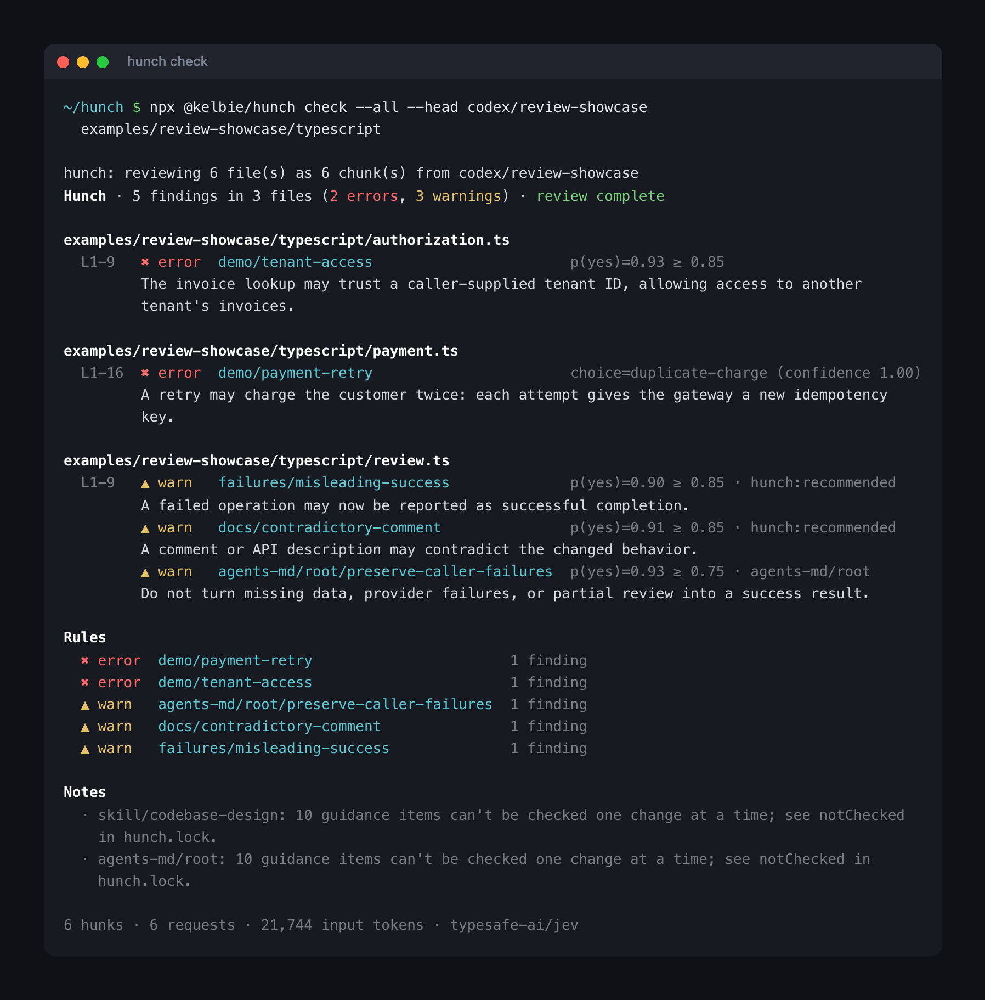

# Hunch 🔮

Code review for the mistakes type checkers and linters miss. You write rules in plain English, and [Jev](https://docs.typesafe.ai) checks your code against them, locally or on every PR.



## Install

**You need Node 22+.** The GitHub App path needs nothing else. Two extras, only where a step says so:

- a **model key** — [Vercel AI Gateway](https://vercel.com/ai-gateway) → **API Keys → Create key** — to
  review on your own machine or in your own CI. The hosted App brings its own.
- **[Claude Code](https://claude.com/claude-code) or [Codex](https://developers.openai.com/codex/cli/)
  on your PATH**, only to compile Agent Skills and `AGENTS.md` into rules. A model key works instead.

Pick one path — most people want the first. `npx @kelbie/hunch init` asks these same questions
interactively; the steps below are what it does.

### 1. Review every PR — GitHub App (recommended)

No API key, no workflow file, no server.

1. **Install the App.** Open <https://github.com/apps/hunch-review/installations/new>, choose the
   account or organisation that **owns** the repository, then either **All repositories** or **Only
   select repositories** and pick it.
   An organisation is a separate installation from your personal account: installing on your own
   account does not cover `your-org/your-repo`. If you are not an owner of that organisation, GitHub
   turns your choice into a request for an owner to approve, and nothing is reviewed until they do.
2. **Write a config**, from inside the repository:
   ```sh
   npx @kelbie/hunch init
   ```
   Writes `hunch.config.ts`, or `hunch.toml` for Rust and other languages. It starts with ready-made
   checks (presets); add your own rules when you're ready.
3. **Only if this repo has Agent Skills or `AGENTS.md`** — turn them into review questions:
   ```sh
   npx @kelbie/hunch compile
   ```
   It asks which model should do it — any coding agent you have installed, or the Gateway with your
   model key — and `--with claude|codex|gateway` skips the question. Writes `hunch.lock`; read it
   before committing, because it is the guidance Hunch will actually check. Skipping this step does
   not turn your guidance off: reviews still run, and each one reports that your guidance is
   uncompiled rather than quietly ignoring it.
4. **Commit to your default branch:**
   ```sh
   git add hunch.config.ts        # and hunch.lock, if you ran compile
   git commit -m "Review PRs with Hunch"
   git push
   ```
   Hunch reads its rules from the **base** branch, so nothing is reviewed until this is merged. The PR
   that adds Hunch is skipped with a notice — that is expected, not a failure.
5. **Open a PR.** Hunch adds a `hunch` check and review comments on the changed lines. Ask for a fresh
   look any time by commenting `/hunch recheck`.

No review appeared? Run `npx @kelbie/hunch doctor` — it names the one thing that is missing.

### 2. Review on your machine

1. ```sh
   npx @kelbie/hunch init
   ```
   Answer **This machine only** when it asks where reviews should run, and paste your model key when
   it asks. It stores the key in `.env.local`, adds that file to `.gitignore`, and never writes it
   into `hunch.config.ts`.
2. Only if you skipped the key, or ran with a flag: put it in your shell or `.env.local` yourself.
   Hunch reads `AI_GATEWAY_API_KEY` from the environment, `.env.local` or `.env`:
   ```sh
   export AI_GATEWAY_API_KEY=…
   ```
3. ```sh
   npx @kelbie/hunch check
   ```
   Reviews this branch against `origin/main`. Add `--base <branch>` if your default branch is not
   `main`, and commit or stage your work first — `check` reviews the diff, so an unchanged branch has
   nothing to review.

### 3. Review every PR — GitHub Actions (no App)

Use this to run reviews in your own CI, under your own key.

1. ```sh
   npx @kelbie/hunch init --github
   ```
   Writes the config as above, plus `.github/workflows/hunch.yml`.
2. **Give Actions your model key**, as a repository secret named `AI_GATEWAY_API_KEY`. Either:
   ```sh
   gh auth login                      # once, if the GitHub CLI isn't signed in
   gh secret set AI_GATEWAY_API_KEY
   ```
   or paste it under **Settings → Secrets and variables → Actions → New repository secret**. Without
   it the workflow stops on its first step and says so.
3. Commit and merge **both** `hunch.config.ts` and `.github/workflows/hunch.yml` to your default
   branch — plus `hunch.lock` if you compiled guidance. As above, the PR that adds them is skipped
   with a notice.
4. **Open a PR.** The review appears under **Checks → Hunch**, with each concern marked on the changed
   lines.

Fork PRs are not reviewed on this path — Actions withholds secrets from forks. Use the App for those.

> On Vercel Hobby, add `zeroDataRetention: false` (TOML: `zero-data-retention = false`) to your config. The default needs Pro or Enterprise.

Running your own deployment of the App instead of the hosted one: [operator setup](docs/cli-setup.md).

## Commands

| Command | What it does |
| --- | --- |
| `check` | Reviews the lines changed on this branch (and uncommitted work) vs `origin/main`. |
| `check --staged` | Reviews staged changes only. |
| `check --base main --head feature/x` | Reviews the difference between two branches, without checking out. |
| `check --all [path]` | Reviews whole files, not just changes. Use a folder to keep it small. |
| `check --all --dry-run` | Counts files and questions without sending anything. |
| `check --show-diff` | Prints the changed lines under each finding. Handy for agents fixing findings. Works with `--reporter json` too. |
| `check --config <json\|file\|->` | Uses rules from JSON instead of the repo's config. [Details](#rules-without-a-config-file) |
| `check --rule id="…"` | Adds a plain-English rule for this run. Repeatable. |
| `find "<task>"` | Ranks every chunk of the repository by how it relates to a change you are about to make. [Details](#finding-the-code-for-a-change) |
| `compile` | Turns your skills and `AGENTS.md` into review questions, saved in `hunch.lock`. [Why?](#skills-and-agentsmd) |
| `init [--ts\|--rust\|--general] [--github]` | Writes a starter config, and optionally a PR workflow. Asks where reviews should run when it has a terminal; any flag skips the questions. |
| `doctor` | Says why this repository is not being reviewed, and what to do about it. |
| `eval <dir>` | Measures each rule's precision and recall on labelled `.diff` examples. |
| `app --help` | Sets up a self-hosted GitHub App. |

Run each as `npx @kelbie/hunch <command>`. Every `check` also takes paths to narrow the review, and `--reporter text|markdown|json|sarif|github`.

## Finding the code for a change

`check` asks whether code is wrong. `find` asks where code *is* — it scores every chunk of the
repository against a task you describe, and returns the ones worth reading before you start.

```sh
npx @kelbie/hunch find "warn on the amountless onchain receive QR with the mint's minimum and maximum"
```

Each chunk is asked five questions at once, because "show me the tests" and "show me where to type"
are different requests that one relevance score would blur together:

| Facet | The question |
| --- | --- |
| `edit` | Would doing this require editing these lines? |
| `contract` | Does this define the value, limit or type the task hinges on? |
| `caller` | Does this consume the behaviour that would change? |
| `test` | Does this test the area, so it would need updating or would catch a mistake? |
| `precedent` | Does this already solve the same kind of problem somewhere else? |

The answer is a probability per facet, so the output is grouped by what each chunk *is* rather than
flattened into one list. `--top` is per facet for the same reason: the single test worth updating is
not crowded out by thirty definitions.

```sh
hunch find "…" --dry-run                  # count chunks and requests before spending anything
hunch find "…" app/features wallet        # narrow by path
hunch find "…" --facet test,precedent     # ask only what you want back
hunch find "…" --min 0.7 --top 5          # fewer, surer
hunch find "…" --format code > context.md # one Markdown document, to paste into a larger model
```

`--format code` is the point of the command: it emits the matched source, fenced and grouped, as a
starting context for a model that reasons better than Jev but cannot afford to read your whole
repository. `--format json` gives every facet probability for each match.

A sweep is one request per chunk, run concurrently (`--concurrency`, default 8). It is deliberately
not narrowed by keyword first: the code you most need is often the code you would not have grepped
for. If the sweep is cut short by its budget it says so and exits `2`, because a partial answer that
looks whole is worse than no answer.

## Rules without a config file

Review a repository that doesn't use Hunch by passing the rules on the command line. `--config` takes the same options as `hunch.config.ts`, written as JSON:

```sh
cd ../some-repo
npx @kelbie/hunch check --config - <<'EOF'
{
  "include": ["**/*.md"],
  "rules": {
    "spec/names": { "level": "error", "noul": "Does `hunk` name a field or endpoint differently from how it's defined in `hunk`?", "threshold": 0.85 },
    "spec/breaking": { "level": "error", "choice": "How does this change affect existing implementations?",
      "criteria": { "editorial": "Wording only.", "additive": "Adds something optional.", "breaking": "Changes the wire format." },
      "report": ["breaking"] },
    "spec/examples": ["warn", "Normative text must agree with the examples next to it."]
  }
}
EOF
```

- **`--config`** takes inline JSON, a file path, or `-` for stdin. Repeat it to layer overrides, e.g. `--config rules.json --config '{"zeroDataRetention":false}'`. Later values win, and `rules` and `budget` merge key by key.
- **`--rule id="…"`** adds a plain-English `warn` rule. Use it alone or on top of any config.
- Rules can be `"off"`, `["warn", "plain English"]`, or a table like `{ "level": "error", "noul": "…" }` (also `choice` and `score`, with the same options as in `hunch.config.ts`).
- Skills and `AGENTS.md` are off for inline configs, because the repo has no `hunch.lock`. Turn them on with `"agentsMd": true` if you've compiled one.

[`examples/inline/cashu-nuts.json`](examples/inline/cashu-nuts.json) is a full rule set for the [Cashu NUTs](https://github.com/cashubtc/nuts) specs: `npx @kelbie/hunch check --config cashu-nuts.json`.

## On pull requests

With the [GitHub App](docs/cli-setup.md), each concern is a normal review comment on the changed lines, so it shows the real diff and you can reply to it. One summary comment lists them all, errors first, linking to each thread.

- **Not relevant?** Resolve the conversation. Hunch won't raise that rule in that file again on this PR. Only resolutions by people with write access count.
- **Fixed it?** Push. Hunch resolves its own comments for concerns that are gone.
- **Want a fresh look?** Comment `/hunch recheck`.

## Rules

Rules live in `hunch.config.ts` or `hunch.toml`. Each has a level: `"warn"`, `"error"` or `"off"`. This example shows every kind of setting; you only need `extends` and a few rules to start.

```ts
import { choice, defineConfig, noul, score } from "@kelbie/hunch";

export default defineConfig({
  // Ready-made checks. Change or turn off any of them under `rules`.
  extends: ["hunch:recommended", "hunch:typescript"],

  // Which files are reviewed. Lockfiles, minified files and node_modules are always skipped.
  include: ["src/**"],
  ignore: ["src/generated/**"],

  rules: {
    // Plain English: flagged when a change likely breaks the sentence.
    "api/stable-errors": ["warn", "Changing an error returned to API clients must not remove information they rely on to recover."],

    // noul: a yes/no question, flagged when P(yes) >= threshold.
    "tests/weakened": ["error", noul({
      instructions: "Does `hunk` remove or loosen an assertion without adding an equivalent check?",
      criteria: { true: "An assertion is deleted or made looser.", false: "Assertions are unchanged, stricter or only renamed." },
      threshold: 0.8,
      files: ["**/*.test.ts"],            // only ask about these files
      when: /expect|assert/,              // only ask when the change matches (saves requests)
      message: "A test may have been weakened.",  // what reviewers see
    })],

    // choice: Jev picks one label; labels listed in `report` are flagged.
    "payments/retry-safety": ["error", choice({
      instructions: "If the payment call in `hunk` is retried, what happens to the customer?",
      criteria: {
        "safe": "Retries reuse the same idempotency key, so the customer is charged once.",
        "duplicate-charge": "A retry can charge the customer again.",
        "not-applicable": "The change does not retry a payment.",
      },
      report: ["duplicate-charge"],
      minConfidence: 0.5,
      reference: "docs/api-contracts.md",  // a file from the base branch sent along as context
    })],

    // score: ordered levels, worst to best; flagged below reportBelow (0–1).
    "tests/specific": ["warn", score({
      instructions: "How precisely do the tests changed in `hunk` pin down the behavior they cover?",
      criteria: [
        "They only check that the code runs without throwing.",
        "They check broad properties, such as a result being defined.",
        "They check exact outputs for the main case.",
        "They check exact outputs, including edge cases and failures.",
      ],
      reportBelow: 0.5,
      files: ["**/*.test.ts"],
    })],

    // Change a preset's level, or turn it off.
    "docs/contradictory-comment": "error",
    "typescript/lossy-serialization": "off",
  },

  // Different levels for some folders.
  overrides: [{ files: ["scripts/**"], rules: { "api/stable-errors": "off" } }],

  // Guidance to compile into hunch.lock (see "Skills and AGENTS.md").
  skills: ["./.agents/skills/codebase-design", "mattpocock/skills"],  // omit to use every installed skill; [] for none
  agentsMd: true,
  docs: ["docs/api-contracts.md"],

  failOnError: true,       // fail the check when an error-level concern is found
  task: "pr",              // send the PR title and description as context ("none" to skip)
  zeroDataRetention: true, // set false on Vercel Hobby
  budget: { maxHunks: 100, maxRequests: 100, timeoutSeconds: 180 },
});
```

| Rule type | Flags a change when… |
| --- | --- |
| Plain English | Jev thinks the change likely breaks the sentence. |
| `noul` | The answer to your yes/no question is likely "yes". |
| `choice` | Jev picks one of the labels you listed in `report`. |
| `score` | The change scores below (or above) your threshold on a scale you define. |

Every rule type also takes `files`, `when`, `reference` and `message`. In `hunch.toml` the same rules are tables, with kebab-case option names:

```toml
extends = ["hunch:recommended", "hunch:rust"]
fail-on-error = true

[rules."payments/retry-safety"]
level = "error"
choice = "If the payment call in `hunk` is retried, what happens to the customer?"
criteria = { safe = "...", duplicate-charge = "...", not-applicable = "..." }
report = ["duplicate-charge"]
```

Presets: `hunch:recommended` (any language), `hunch:typescript`, `hunch:rust`. Every option is explained in [configuration](docs/configuration.md).

## Skills and AGENTS.md

Your [Agent Skills](https://github.com/vercel-labs/skills) and `AGENTS.md` often contain good review rules. But they're long prose written for coding agents, and **Jev can only answer short yes/no questions**. So they need converting first:

| | Config rules | Skills and `AGENTS.md` |
| --- | --- | --- |
| Written as | One question each | Pages of prose |
| Jev can use them | Directly | After `compile` |
| Stored in | `hunch.config.ts` / `hunch.toml` | `hunch.lock` |

`compile` sends each skill and `AGENTS.md` to Claude Code or Codex on your machine (you pick from a menu). It writes the questions to `hunch.lock`. Guidance that can't be checked from one change is listed there as `notChecked`.

**Why save the questions in a file instead of generating them on every run?**

- **Same questions every time.** An LLM gives a different list each run. Saved questions make reviews repeatable.
- **You can read what's enforced.** Review `hunch.lock` like code. Edit or delete questions you don't want.
- **CI only needs Jev.** No Claude or Codex login in CI, and each PR is reviewed with the lock from its base branch.

**How often do I compile?** Once, then commit `hunch.lock`. After that, just run `check`. Compile again only when `check` says the lock is stale, because you edited `AGENTS.md` or changed a skill. Only changed sources are recompiled.

```sh
npx skills add mattpocock/skills --skill codebase-design
npx @kelbie/hunch compile         # review hunch.lock, then commit it
```

Without a lock, `check` still runs your config rules and presets, but marks the review as partial because your skills weren't checked. Don't want skills reviewed? Set `skills: []` and `agentsMd: false`.

## Good to know

- Findings are Jev's judgment, not proven bugs.
- Hunch reviews one change (hunk) or chunk at a time, so it can miss bugs that depend on other files. Give a rule the file it needs with `reference`.
- Lockfiles, minified files, source maps and `node_modules` are always skipped. Add more with `ignore`.

## More

- [Configuration](docs/configuration.md): every option, presets and budgets
- [GitHub App](docs/cli-setup.md): bot comments, `/hunch recheck` and fork PRs
- [Sample PR report](docs/sample-report.md)
- [Architecture](docs/architecture.md)
